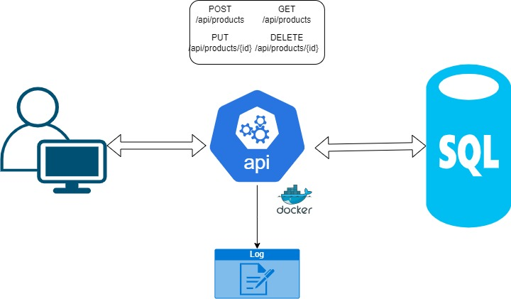

## Introduction

Evaluate proficiency in C# .NET Core development, cloud deployment, microservices architecture, advanced DevOps practices, and a deep understanding of modern development practices including testing, logging, documentation, and security.
## Design 


## Getting Started

### Prerequisites

Before you begin, ensure that you have the following installed on your system:

* [.NET 6 SDK](https://dotnet.microsoft.com/en-us/download/dotnet/6.0)
* [Docker](https://www.docker.com/get-started/)
* [MSSQL Server](https://learn.microsoft.com/en-us/sql/database-engine/install-windows/install-sql-server?view=sql-server-ver16)


### Installing

* Clone this repository (main branch) to your local machine.
```
git clone https://github.com/dennis1254/product_catalog_system.git
```

* Navigate to the src folder of the project and open ProductCatalogSystem.sln with visual studio.


## Running 

### Visual Studio

* Open the solution in Visual Studio.
* Set the startup project to the ProductCatalogSystem.API project.
* Click the run icon on visual studio or Press F5 to run the application.

### Docker

* Build the Docker image:
```
docker build -t product-catalog-api .
```
* Run the Docker container:
```
docker run -p 5000:80 product-catalog-api
```
* The API will be accessible at http://localhost:5000.


## Deployment

CICD pipeline automates deployment to production

## Built With

* [.NET 6 SDK](https://dotnet.microsoft.com/en-us/download/dotnet/6.0) - The web framework used
* [MSSQL Server](https://learn.microsoft.com/en-us/sql/database-engine/install-windows/install-sql-server?view=sql-server-ver16) - Application database
* [Serilog](https://github.com/serilog/serilog/wiki/Getting-Started) - For logging


## Test or use-cases

- Open `http://localhost:5000/swagger` on your browser
- Use `gateway` as username and `password10$` as password
- Try the endpoints using sample request on the swagger.

## Version History
* ***Release 0.0.0***
  - *Features*
    - GET /api/products: Retrieve a paginated list of products, supporting optional filtering, sorting, and caching.
    - POST /api/products: Add a new product.
    - GET /api/products/{id}: Retrieve details of a specific product.
    - PUT /api/products/{id}: Update an existing product.
    
  - *Known Issues*
    - N/A

## References
    - Design Link - N/A

## Contributors
Contributors names and contact info:

* [Owhiroro Dennis](owhirorodennis@agmail.com) 
